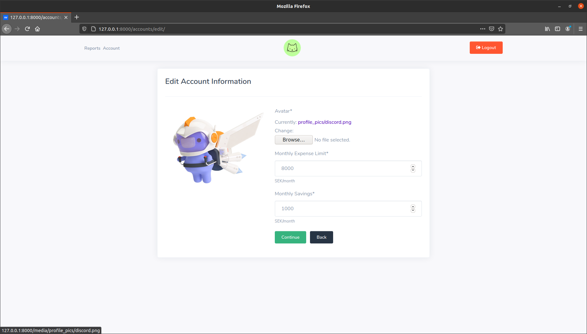

# Mynk
[](https://travis-ci.org/SaipranavK/mynk-dj.svg?branch=master)

Mynk supports monthly budget management with expense visualizations, alerts and monthly reports to review your purchases. Users can set monthly expense limit and distrubute this sum into different categories. All the expenses made will be associated to a specific category declared by the user. Based on the expense limit and expense rate, Mynk will warn the user if they are overspending. Stats are updated daily. User can monitor their daily average expense along side category wise distrubution of their total expense so far. After every month, the expenses are translated into monthly reports for later reference. 

<b>Live Preview:</b> https://mynk.saipranavk.usw1.kubesail.org/accounts/authenticate/

---

## Usage
To run mynk as a docker container use command
```
docker run saipranavk/mynk:tag
```

Mynk repository (https://hub.docker.com/repository/docker/saipranavk/mynk) in docker hub holds different tags generated from branches passing the travis-ci checks.
It is recommended to use master tag for stable release. 

Alternatively, you can run mynk as a django project.

1. First clone the repository using 
```
git clone https://github.com/SaipranavK/mynk-dj.git
```

2. In the project directory, install all the dependencies using command
```
pip install -r requirements.txt
```

3. After setting up the environment, use command
```
python manage.py runserver
```

## Screenshots



## Todos

- [ ] Manage alerts
- [ ] Manage Reports
- [ ] Write unit and integration tests for all apps